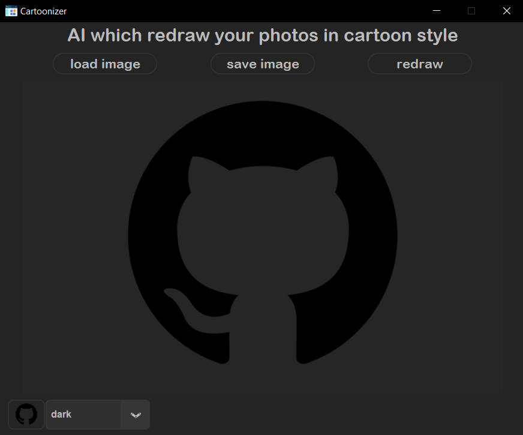
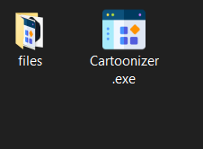
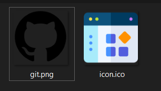

Cartoonizer
---
This program which redraw your photos in cartoon style, with open source code which written on Python.

***
### 🎬What is it

Simple and understandable GUI.
If you want to change something in code you need to know how [CustomTkinter](https://github.com/TomSchimansky/CustomTkinter/wiki) and  [Tkinter](https://docs.python.org/3/library/tkinter.html) works and also Phyton.

---
### 🔨How to compile it
So firstly you need to download [python](https://www.python.org/downloads/). Then run Compile.bat and .exe file need to be in one directory with the files folder.
Or you can copy .exe file to ready folder, and all files which place in the ready folder is files for .exe
Final result:

What need to be in files folder:

more [here](https://github.com/TomSchimansky/CustomTkinter/wiki/Packaging)

---
### ❌Builder errors

If you have error like this:

How to solve it read [here](https://www.stechies.com/pip-not-recognized-internal-external-command/)

---
### 📲Contacts
##### __Discord: 𝔰𝔦𝔩𝔳𝔢𝔯 𝔰𝔥𝔞𝔡𝔬𝔴#5304__

---
[go up](#up)
